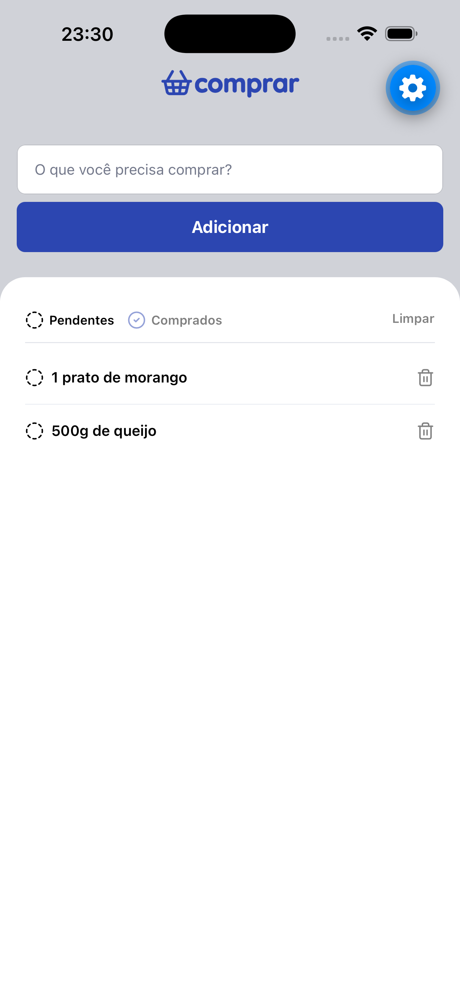

# 🛒 Comprar App

Aplicativo mobile de lista de compras desenvolvido durante a **Formação React Native** da [Rocketseat](https://rocketseat.com.br).

<p align="center">
  
</p>

---

## 📱 Sobre o projeto

O **Comprar** é um app simples e funcional para gerenciar sua lista de compras. Com ele você pode:

- ➕ **Adicionar** itens à lista
- 🗑️ **Remover** itens da lista
- ✅ **Marcar** itens como comprado

A persistência dos dados é feita com o **AsyncStorage**, solução de armazenamento local assíncrono do React Native. Isso garante que a lista de compras seja mantida mesmo após fechar o aplicativo, sem a necessidade de um servidor ou banco de dados externo.

---

## 🚀 Tecnologias

- [React Native](https://reactnative.dev)
- [Expo](https://expo.dev)
- [TypeScript](https://www.typescriptlang.org)

---

## 🔧 Como executar

**Pré-requisitos:** Node.js, pnpm e Expo Go instalado no celular (ou um emulador).

```bash
# Clone o repositório
git clone <url-do-repositorio>

# Acesse a pasta
cd comprar

# Instale as dependências
pnpm install

# Inicie o projeto
pnpm start
```

Escaneie o QR Code com o app **Expo Go** (Android) ou a câmera (iOS).

---

<p align="center">
  Feito durante a Formação React Native da <strong>Rocketseat</strong>
</p>
